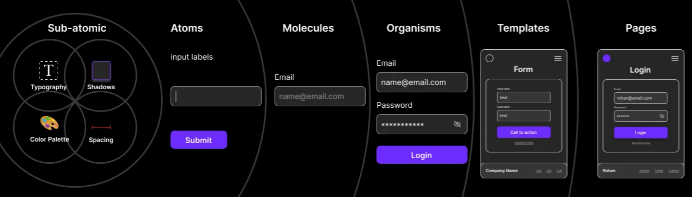

## Atomic Design

  
   
  <a href="https://atomicdesign.bradfrost.com/" target="_blank">Atomic Design Structure</a>

## Description

Atomic Design is a methodology for creating design systems by breaking down components into smaller, reusable building blocks. The structure consists of five levels: Atoms, Molecules, Organisms, Templates, and Pages.

## Sub-Atoms

*<em> - In current structure sub atoms base on ITCSS structure that you can find here.  </em>*

  - [ITCSS.md](./02-style/ITCSS.md)

## Atoms

*<em> - Atoms are the basic building blocks of a design system. They represent the smallest and most fundamental elements. Atoms can be simple HTML tags like buttons, inputs, or icons.  </em>*

#### Example:

- Icon: 0_0
- Button: <button>Click Me</button>
- Input: <input type="text" />

## Molecules

*<em> - Molecules are combinations of atoms that work together to perform a specific function. They are small, reusable components that have more functionality than individual atoms.  </em>*

#### Example:

Navbar: A combination of a logo, navigation links, and a search bar.
Card: A combination of an image, title, and description.

## Organisms

*<em> - Organisms are combinations of molecules and/or atoms that form a distinct section or component of a user interface. They are larger and more complex than molecules..  </em>*

#### Example:

Header: A combination of a navbar and a hero banner.
Product List: A combination of multiple product cards.

## Templates

*<em> - Templates provide the overall structure of a page or layout. They combine multiple organisms to create a specific page design.  </em>*

#### Example:

 Homepage Template: A layout that combines the header, product list, and footer to create the homepage.

## Pages

*<em> - Pages are specific instances of templates with real content. They represent actual pages in the application or website.  </em>*

#### Example:

Home Page: An instance of the homepage template with real product data.
By following the Atomic Design structure, you can create a scalable and consistent design system for your project, making it easier to maintain and extend in the future.

## 
### [Back to README](../README.md)
## 
