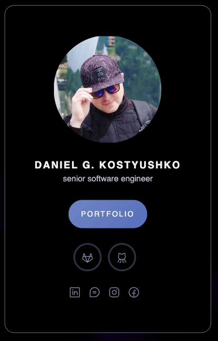
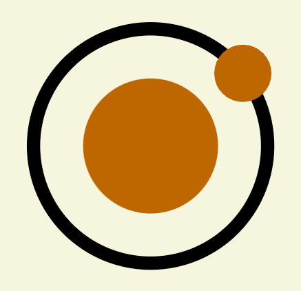
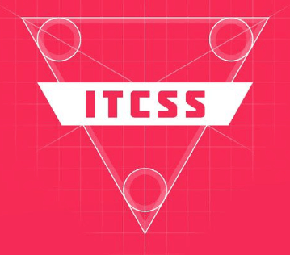
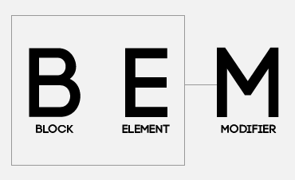

## V-Card

<p align="center">
  
  <br>
  <a href="https://dn.gooko.org/vue/card/" target="_blank">View a demo</a>
</p>

## Description
In this Vue 3 project, we showcase the elegance of simplicity and efficiency, utilizing CDN connections exclusively for seamless deployment. Embracing the Atomic Design structure, our components are thoughtfully organized into distinct levels—atoms, molecules, organisms, and templates—fostering reusability, maintainability, and a systematic approach to building scalable applications. Moreover, you can enjoy an example of using a YouTube video for the background using its setting in form of properties and configurate project style vie ITCSS structure.

<table align="center">
  <tr>
    <td align="center"></td>
    <td align="center"></td>
    <td align="center"></td>
    <td align="center"></td>
  </tr>
  <tr>
    <td align="center">Vue.js</td>
    <td align="center">Atomic Design</td>
    <td align="center">ITCSS</td>
    <td align="center">BEM</td>
  </tr>
</table>

## Getting Started

*<em> - Clone project to your local machine: </em>*

```bash
git clone https://github.com/gk-daniel/v-card.git
```  

*<em> - Navigate to the project directory using the cd command: </em>*

```bash
cd v-card
```  

*<em> - Open index file in browser  </em>*

```css
index.html
```  

## Structure of Project

Here you can find technical documentation in the file system folder feed containing descriptions of the files and concepts that were used to build the code.

*<em> - Directory containing additional info about project. </em>*

- `01-docs` => [INTRO.md](./01-docs/00-Introduction.md)

*<em> - Directory containing stylesheets. </em>*

- `03-style` => [ITCSS.md](./03-style/ITCSS.md)

*<em> - Directory containing JavaScript files. </em>*

- `04-components` => [A-Design.md](./04-components/A-Design.md)

*<em> - Directory for storing assets like images and fonts. </em>*

- `05-assets` => [FBF.md](./05-assets/FBF.md)

## Extensions of VS Code 

*<em>- Recommended extensions for Visual Studia Code</em>*

- [1. Vue Language Features](https://github.com/vuejs/language-tools)
- [2. Better Comments](https://github.com/aaron-bond/better-comments)
- [3. Bracket Pair Color DLW](https://github.com/EmersonGarrido/bracket-pair-dlw)
