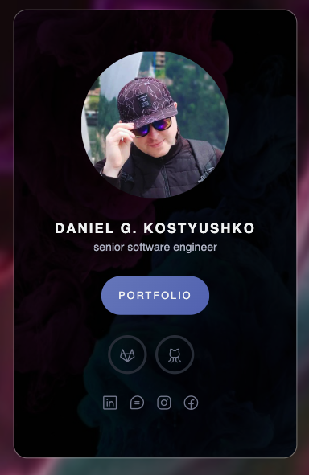

## V-Card

  
   
  <a href="https://dn.gooko.org/vue/card/" target="_blank">View a demo</a>

## Description

In this Vue 3 project, we showcase the elegance of simplicity and efficiency, utilizing CDN connections exclusively for seamless deployment. Embracing the Atomic Design structure, our components are thoughtfully organized into distinct levels—atoms, molecules, organisms, and templates—fostering reusability, maintainability, and a systematic approach to building scalable applications. Moreover, you can enjoy an example of using a YouTube video for the background using its setting in Vue 3.

## Contents

*<em>- Table of Contents</em>*

- [1. Installation](./00-config/readme/01-Installation.md)
- [2. Contribution](./00-config/readme/02-Contribution.md)

## Extensions

*<em>- Recommended extensions for VS Code</em>*

- [1. Vue Language Features](https://github.com/vuejs/language-tools)
- [2. Better Comments](https://github.com/aaron-bond/better-comments)
- [3. Bracket Pair Color DLW](https://github.com/EmersonGarrido/bracket-pair-dlw)
## Sources

*<em>- Links to used sources</em>*

- [1. Vue.js](https://vuejs.org/)
- [2. Atomicdesign](https://atomicdesign.bradfrost.com/)
- [3. Phosphoricons](https://phosphoricons.com/)
